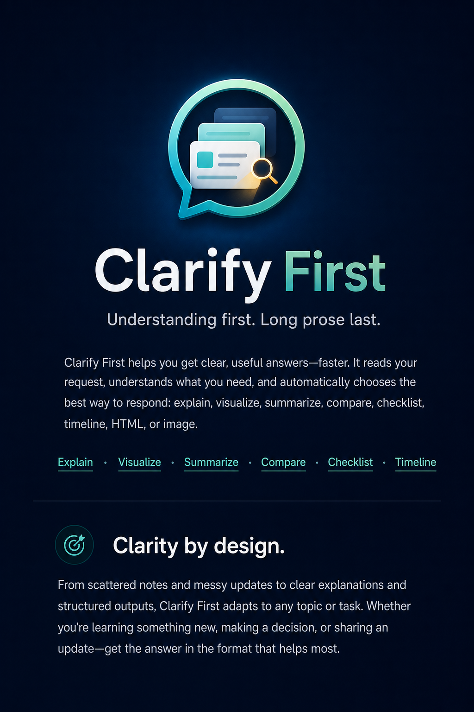

<div align="center">
  <h1>Clarify First</h1>

  <p><strong>Understanding first. Long prose last.</strong></p>

  <p>Installable Codex skill package for turning dense answers into the clearest shape for the user's goal.</p>

  <p><strong>Multilingual-ready.</strong> Mirrors the user's language by default, including Korean, English, and mixed-language prompts.</p>

  <p><strong>Smart by default.</strong> Chooses the clearest output mode on its own when a visual, table, or HTML layout will help more than plain Markdown.</p>

  <p><strong>Skill trigger:</strong> <code>$clarify-first</code> · <strong>npm package:</strong> <code>clarify-first</code></p>

  <p>
    <a href="#how-it-chooses">How it chooses</a> ·
    <a href="#example-prompts">Example prompts</a> ·
    <a href="#install">Install</a> ·
    <a href="#package-contents">Package contents</a>
  </p>
</div>

<hr />

<p align="center">
  
</p>

## How it chooses

When a reply is too dense for plain Markdown, the skill picks the shape that makes it easiest to understand. It does not just paraphrase text.

| User intent | Mode | Typical output |
| --- | --- | --- |
| "Explain this" | `explain` | concise explanation with key points |
| "Show me the structure" | `visualize` | flow, diagram, or hierarchy |
| "What did you do?" | `summarize_actions` | transformation summary |
| "Which is better?" | `compare` | trade-off view |
| "What should I do next?" | `checklist` | actionable checklist |
| "How did this happen?" | `timeline` | ordered sequence |
| "Make it a page" | `html` | readable HTML brief |
| "Make it visual" | `image` | single infographic or visual summary |

When nothing is explicit, it falls back to a concise structured brief:

1. Takeaway
2. Why it matters
3. Key points
4. Next step
5. Risks or open questions

## Example prompts

Use the skill when the raw answer would be hard to scan in plain Markdown:

```text
Use $clarify-first to turn this dense update into a clean visual brief.
Use $clarify-first to explain this concept as a checklist.
Use $clarify-first to summarize what changed and what happens next.
```

## Install

### From git

```bash
git clone https://github.com/Jun0zo/clarify-first.git
cd clarify-first
npm install
npx clarify-first-install
```

### From a git URL with npm

```bash
npm install git+https://github.com/Jun0zo/clarify-first.git
npx clarify-first-install
```

### From npm

```bash
npm install clarify-first
npx clarify-first-install
```

## Publish to npm

You need an authenticated npm session before publishing.

```bash
npm login
npm publish --access public
```

The package is published as `clarify-first@0.1.3`, so `npm install clarify-first` should work now.

The npm package name now matches the skill name: `clarify-first`.

## Where it installs

By default, the installer copies the skill into:

`$CODEX_HOME/skills/clarify-first`

If `CODEX_HOME` is unset, it falls back to `~/.codex/skills/clarify-first`.

## Package contents

- `README.md`
- `package.json`
- `scripts/install-skill.js`
- `skill/SKILL.md`
- `skill/agents/openai.yaml`
- `skill/references/classification.md`
- `skill/assets/clarify-first-icon.png`
- `skill/assets/clarify-first-hero.png`

## Evaluation

Benchmark development now lives in a separate repo: [RepBench](https://github.com/Jun0zo/repbench).

This repo stays focused on the installable skill package, while the eval repo can change independently as the benchmark cases and scorer evolve.
